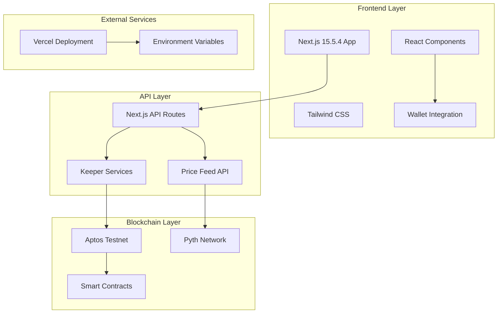

# 🚀 Orion - APT/USD Binary Options Platform

[](https://aptoslabs.com/)
[](https://opensource.org/licenses/MIT)
[](https://nextjs.org/)
[](https://move-language.github.io/)

> **A decentralized binary options platform for betting on APT/USD price movements with automated rounds, real-time price feeds, and instant payouts.**

## 📋 Table of Contents

- [Problem Statement](#-problem-statement)
- [Live Demo](#-live-demo)
- [Technical Architecture](#-technical-architecture)
- [Smart Contract Design](#-smart-contract-design)
- [Getting Started](#-getting-started)
- [Environment Setup](#-environment-setup)
- [Deployment Guide](#-deployment-guide)
- [API Documentation](#-api-documentation)
- [Contributing](#-contributing)
- [License](#-license)

## 🎯 Problem Statement

Traditional betting platforms suffer from:
- **Centralized control** and potential manipulation
- **Lack of transparency** in price feeds and settlement
- **Slow payouts** and complex withdrawal processes
- **Limited accessibility** to global markets
- **High fees** and hidden costs

**Orion solves these problems by:**
- ✅ **Decentralized betting** on Aptos blockchain
- ✅ **Real-time price data** from Pyth Network
- ✅ **Automated settlement** with 1.8x instant payouts
- ✅ **Transparent smart contracts** with public verification
- ✅ **24/7 automated rounds** with 60-second intervals

## 🌐 Live Demo

**🔗 Production URL:** [orion-eosin.vercel.app/](https://orion-eosin.vercel.app/)

**📱 Features:**
- Real-time APT/USD price chart
- Live betting rounds with countdown timers
- Instant claim system for winnings
- Past rounds history and analytics
- Mobile-responsive design

## 🏗️ Technical Architecture

### Backend Architecture



### System Components

| Component | Technology | Purpose |
|-----------|------------|---------|
| **Frontend** | Next.js 15.5.4, React 19, TypeScript | User interface and wallet integration |
| **Styling** | Tailwind CSS 4, Lucide Icons | Modern, responsive design |
| **State Management** | Zustand | Global application state |
| **Blockchain** | Aptos SDK, Move Language | Smart contract interactions |
| **Price Feeds** | Pyth Network | Real-time APT/USD price data |
| **Deployment** | Vercel | Production hosting and CI/CD |
| **Charts** | Lightweight Charts | Price visualization |

## 🔧 Smart Contract Design

### Core Module: `orion_betting::betting`

The smart contract is built using the Move language and follows Aptos best practices for security and efficiency.

#### Key Functions

```move
module orion_betting::betting {
    // Core Functions
    public entry fun init(admin: &signer, fee_bps: u64, treasury: address)
    public entry fun start_round(admin: &signer, start_price: u64, duration_secs: u64)
    public entry fun place_bet(user: &signer, admin_addr: address, round_id: u64, side_up: bool, amount: u64)
    public entry fun settle(admin: &signer, round_id: u64, end_price: u64)
    public entry fun claim(admin: &signer, round_id: u64, user_addr: address)
    public entry fun batch_claim(admin: &signer, round_id: u64, user_addresses: vector<address>)
    
    // View Functions
    public fun get_current_round_id(admin_addr: address): u64
    public fun get_round(admin_addr: address, round_id: u64): Round
    public fun get_user_bet(admin_addr: address, round_id: u64, user_addr: address): UserBet
    public fun calculate_potential_payout(admin_addr: address, round_id: u64, user_addr: address): u64
}
```

#### Data Structures

```move
struct State has key {
    admin: address,
    current_id: u64,
    rounds: Table<u64, Round>,
    fee_bps: u64,
    treasury: address,
}

struct Round has store {
    id: u64,
    start_price: u64,        // Price in micro-dollars (6 decimals)
    end_price: u64,
    expiry_time_secs: u64,
    settled: bool,
    up_pool: u64,
    down_pool: u64,
    user_bets: Table<address, UserBet>,
}

struct UserBet has store {
    side_up: bool,           // true = UP, false = DOWN
    amount: u64,             // Bet amount in octas (8 decimals)
    claimed: bool,
}
```

#### Key Features

- **1.8x Payout System**: Winners receive 1.8x their bet amount {this ensures protocols concurrent revenue stream}
- **Pool-Based Betting**: All bets go into UP/DOWN pools
- **Automated Settlement**: Smart contract handles round settlement
- **Batch Claims**: Efficient claiming for multiple users
- **Treasury Management**: Lost bets go to treasury address
- **Event System**: Comprehensive event logging for transparency

#### Security Features

- **Time-Based Validation**: Rounds expire automatically
- **Amount Validation**: Minimum bet amounts enforced
- **State Consistency**: Atomic operations prevent race conditions
- **Error Handling**: Comprehensive error codes and messages

## 🚀 Getting Started

### Prerequisites

- **Node.js** 18+ and npm/yarn
- **Aptos CLI** for smart contract deployment
- **Petra Wallet** or compatible Aptos wallet
- **Git** for version control

### Installation

1. **Clone the repository**
```bash
git clone https://github.com/your-username/orion-betting.git
cd orion-betting
```

2. **Install dependencies**
```bash
npm install
# or
yarn install
```

3. **Set up environment variables**
```bash
cp .env.example .env.local
```

4. **Configure your environment** (see [Environment Setup](#-environment-setup))

5. **Start development server**
```bash
npm run dev
# or
yarn dev
```

6. **Open your browser**
Navigate to `http://localhost:3000`

## ⚙️ Environment Setup

### Required Environment Variables

Create a `.env.local` file with the following variables:

```bash
# Aptos Network Configuration
NEXT_PUBLIC_APTOS_NETWORK=testnet
NEXT_PUBLIC_APTOS_NODE_URL=https://api.testnet.aptoslabs.com/v1
NEXT_PUBLIC_APTOS_API_KEY=your_aptos_api_key_here
NEXT_PUBLIC_MODULE_ADDRESS=your_deployed_contract_address

# Deployment Configuration
NEXT_PUBLIC_VERCEL_URL=your_vercel_deployment_url

# Price Feed Configuration
NEXT_PUBLIC_PYTH_ENDPOINT=https://hermes.pyth.network
NEXT_PUBLIC_PYTH_APT_USD_PRICE_ID=0x03ae4db29ed4ae33d323568895aa00337e658e348b37509f5372ae51f0af00d5

# Keeper Configuration (for automated rounds)
KEEPER_PRIVATE_KEY=ed25519-priv-0x_your_private_key_here
ROUND_DURATION_SECONDS=60

# Additional API Keys
GEOMI_API_KEY=your_geomi_api_key_here
```

### Example Configuration

Here's a working example from our current setup:

```bash
NEXT_PUBLIC_APTOS_NETWORK=testnet
NEXT_PUBLIC_APTOS_NODE_URL=https://api.testnet.aptoslabs.com/v1
NEXT_PUBLIC_APTOS_API_KEY=your_geomi_api_key
NEXT_PUBLIC_MODULE_ADDRESS=0x521ede792ad5eee5aece4e9e14bdf3c931f5e8d54939efc39b38afd7dd872cea
NEXT_PUBLIC_VERCEL_URL=orion-4dviyhaso-himanshuranjan007s-projects.vercel.app
NEXT_PUBLIC_PYTH_ENDPOINT=https://hermes.pyth.network
NEXT_PUBLIC_PYTH_APT_USD_PRICE_ID=0x03ae4db29ed4ae33d323568895aa00337e658e348b37509f5372ae51f0af00d5
KEEPER_PRIVATE_KEY=your_private_key
ROUND_DURATION_SECONDS=60
GEOMI_API_KEY=your_geomi_api_key_secret_here
```

## 🚀 Deployment Guide

### Smart Contract Deployment

1. **Install Aptos CLI**
```bash
curl -fsSL "https://aptos.dev/scripts/install_cli.py" | python3
```

2. **Initialize Aptos project**
```bash
aptos init --network testnet
```

3. **Deploy the contract**
```bash
cd move
aptos move publish --named-addresses orion_betting=0x521ede792ad5eee5aece4e9e14bdf3c931f5e8d54939efc39b38afd7dd872cea
```

4. **Initialize the contract**
```bash
aptos move run --function-id 0x521ede792ad5eee5aece4e9e14bdf3c931f5e8d54939efc39b38afd7dd872cea::betting::init --args u64:100 address:0x521ede792ad5eee5aece4e9e14bdf3c931f5e8d54939efc39b38afd7dd872cea
```

### Frontend Deployment

1. **Build the application**
```bash
npm run build
```

2. **Deploy to Vercel**
```bash
npx vercel --prod
```

3. **Configure environment variables** in Vercel dashboard

## 📚 API Documentation

### Keeper API Endpoints

| Endpoint | Method | Description |
|----------|--------|-------------|
| `/api/keeper/start` | POST | Start the first betting round |
| `/api/keeper/settle` | POST | Settle current round and start next |
| `/api/keeper/auto-manage` | POST | Automatically manage rounds |

### Contract API Endpoints

| Endpoint | Method | Description |
|----------|--------|-------------|
| `/api/contract/init` | POST | Initialize the betting contract |
| `/api/contract/start-round` | POST | Start a new betting round |

### User API Endpoints

| Endpoint | Method | Description |
|----------|--------|-------------|
| `/api/claim` | POST | Claim user winnings |
| `/api/check-winnings` | POST | Check if user has winnings |
| `/api/price` | GET | Get current APT/USD price |

### Example API Usage

```javascript
// Start a new round
const response = await fetch('/api/keeper/start', {
  method: 'POST',
  headers: { 'Content-Type': 'application/json' }
});

// Check user winnings
const winnings = await fetch('/api/check-winnings', {
  method: 'POST',
  headers: { 'Content-Type': 'application/json' },
  body: JSON.stringify({
    roundId: 1,
    userAddress: '0x...'
  })
});
```

## 🛠️ Development

### Project Structure

```
orion/
├── src/
│   ├── app/                    # Next.js app router
│   │   ├── api/               # API routes
│   │   ├── landing/           # Landing page
│   │   └── page.tsx           # Main trading page
│   ├── components/            # React components
│   │   ├── BettingPanel.tsx   # Main betting interface
│   │   ├── TradingChart.tsx   # Price chart component
│   │   ├── ClaimableRewards.tsx # Rewards management
│   │   └── ui/                # Reusable UI components
│   ├── lib/                   # Utility libraries
│   │   ├── aptos.ts          # Aptos SDK integration
│   │   ├── config.ts         # Configuration management
│   │   └── utils.ts          # Helper functions
│   └── store/                 # State management
│       └── betting.ts        # Zustand store
├── move/                      # Smart contracts
│   ├── sources/
│   │   └── betting.move      # Main betting contract
│   └── Move.toml             # Move package configuration
└── public/                    # Static assets
```

### Available Scripts

```bash
npm run dev          # Start development server
npm run build        # Build for production
npm run start        # Start production server
npm run lint         # Run ESLint
```

### Key Dependencies

```json
{
  "dependencies": {
    "react": "19.1.0",
    "next": "15.5.4",
    "@aptos-labs/ts-sdk": "^1.28.0",
    "@aptos-labs/wallet-adapter-react": "^3.7.1",
    "zustand": "^5.0.1",
    "lightweight-charts": "^4.2.0",
    "lucide-react": "^0.460.0"
  }
}
```

## 🤝 Contributing

We welcome contributions! Please follow these steps:

1. **Fork the repository**
2. **Create a feature branch**
```bash
git checkout -b feature/amazing-feature
```
3. **Make your changes**
4. **Add tests** if applicable
5. **Commit your changes**
```bash
git commit -m 'Add amazing feature'
```
6. **Push to the branch**
```bash
git push origin feature/amazing-feature
```
7. **Open a Pull Request**

### Development Guidelines

- Follow TypeScript best practices
- Use meaningful commit messages
- Add JSDoc comments for functions
- Test your changes thoroughly
- Update documentation as needed

## 📄 License

This project is licensed under the MIT License - see the [LICENSE](LICENSE) file for details.

## 🙏 Acknowledgments

- **Aptos Labs** for the blockchain infrastructure
- **Pyth Network** for real-time price feeds
- **Vercel** for deployment platform
- **Next.js Team** for the amazing framework
- **Move Language** for secure smart contracts

## 📞 Support

- **Documentation**: [GitHub Wiki](https://github.com/your-username/orion-betting/wiki)
- **Issues**: [GitHub Issues](https://github.com/your-username/orion-betting/issues)
- **Discord**: [Join our community](https://discord.gg/your-discord)
- **Twitter**: [@OrionBetting](https://twitter.com/orionbetting)

---

**Built with ❤️ by the Orion Team**

*Empowering decentralized betting on Aptos blockchain*
